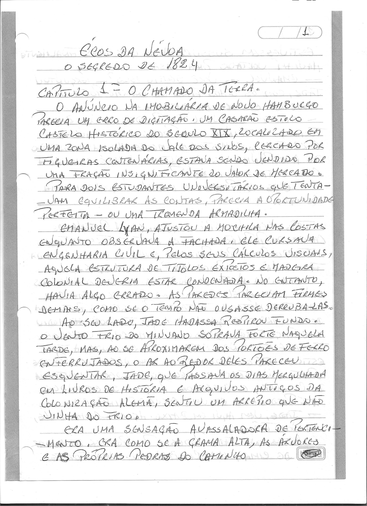
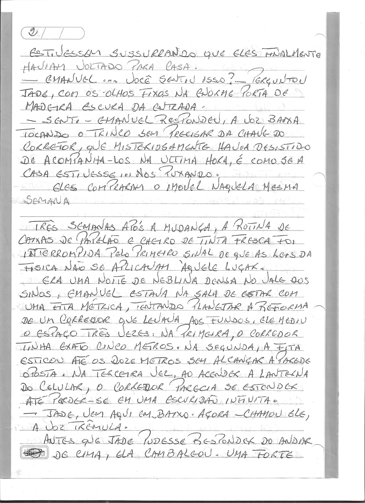
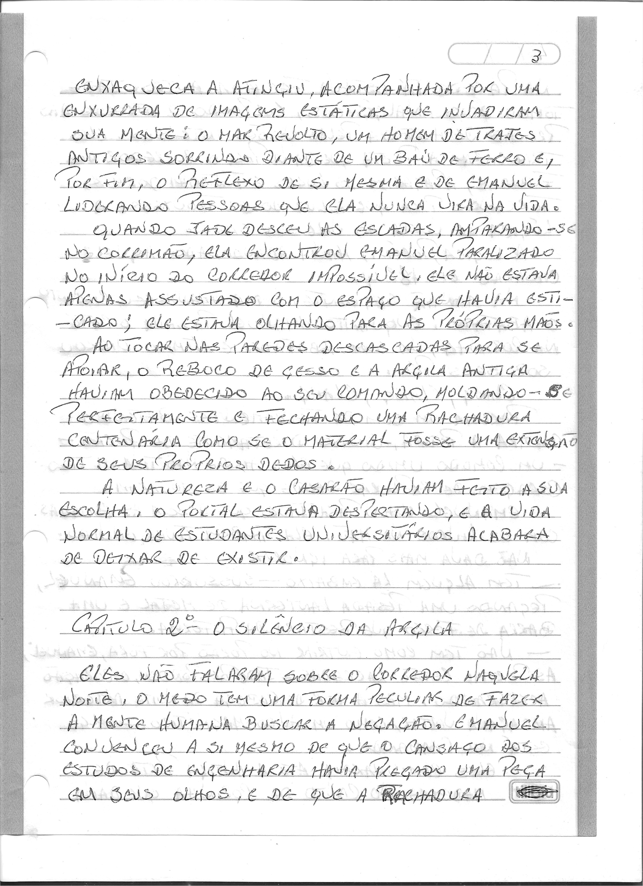

# Capítulo 1: O Chamado da Terra

> Dossiê fac-similar. Uma folha pode conter o final do capítulo anterior ou o início do seguinte. No livro consolidado, cada folha aparece uma vez.

Fonte: `Escrito à mão_2026-09-27_075923.pdf`.

Fonte: `Escrito à mão_2026-09-27_080008.pdf`.

Fonte: `Escrito à mão_2026-09-27_080119.pdf`.
