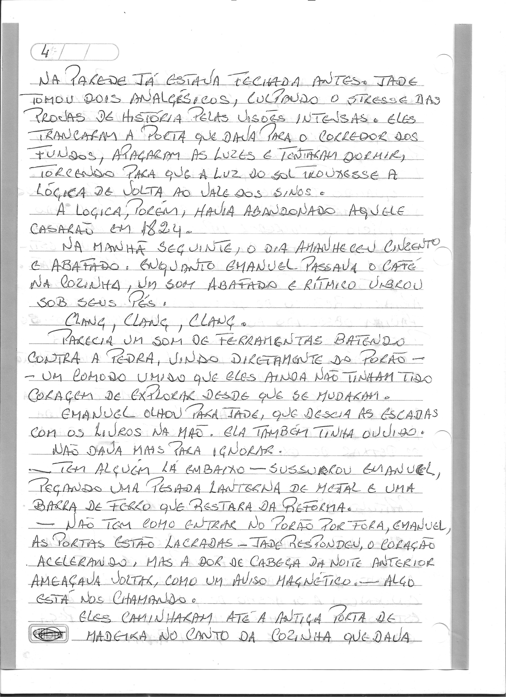
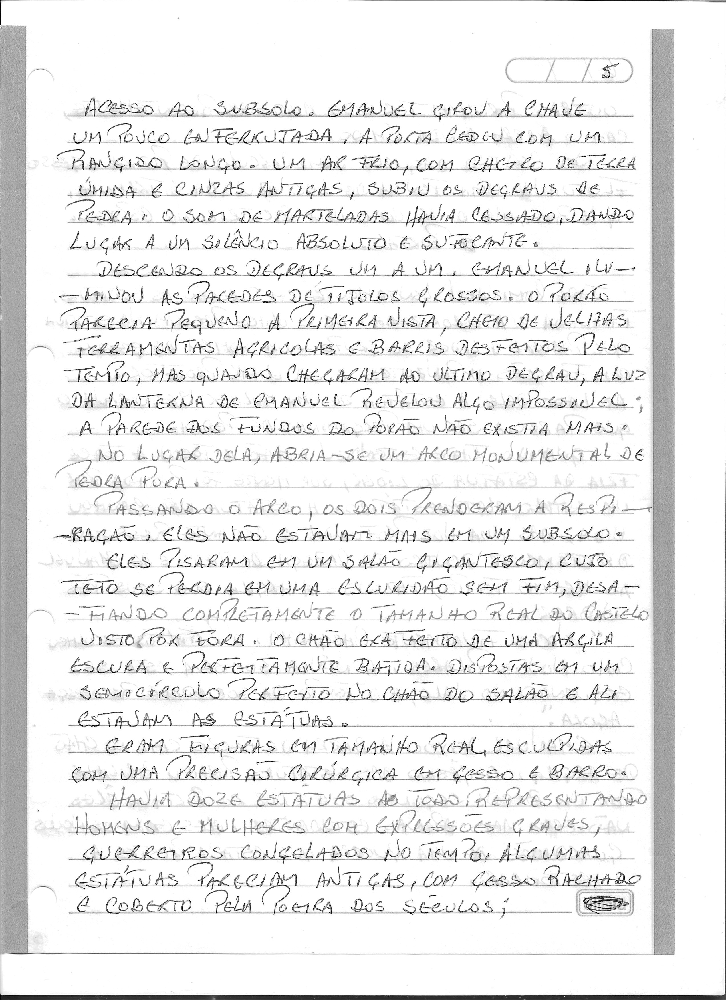
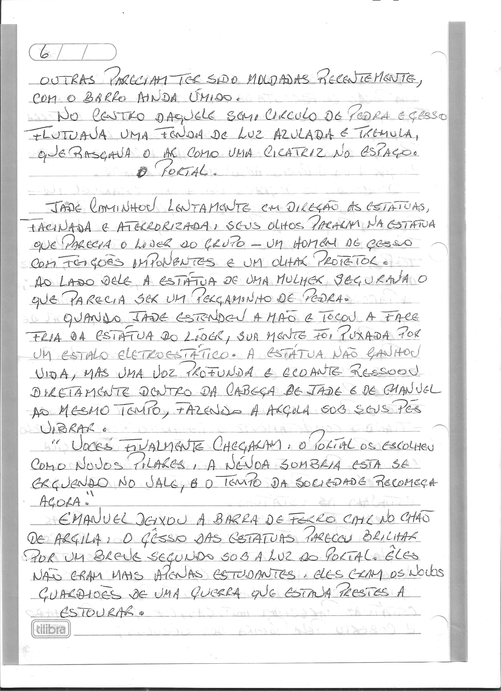
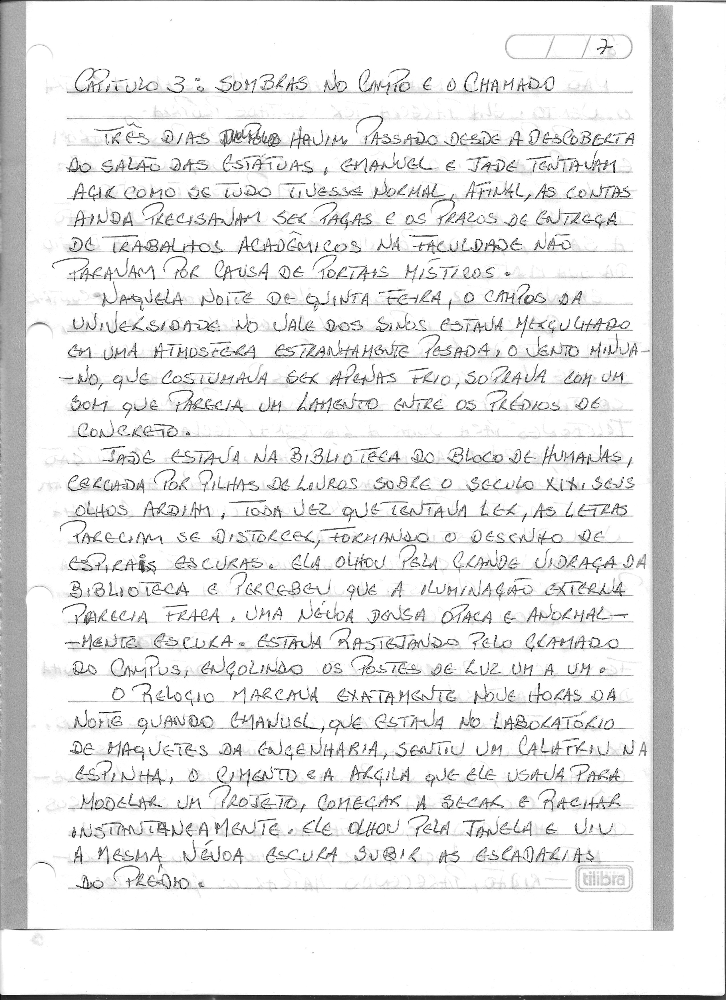

# Capítulo 2: O Silêncio da Argila

> Dossiê fac-similar. Uma folha pode conter o final do capítulo anterior ou o início do seguinte. No livro consolidado, cada folha aparece uma vez.

Fonte: `Escrito à mão_2026-09-27_080119.pdf`.

Fonte: `Escrito à mão_2026-09-27_080201.pdf`.

Fonte: `Escrito à mão_2026-09-27_080301.pdf`.

Fonte: `Escrito à mão_2026-09-27_080352.pdf`.

Fonte: `Escrito à mão_2026-09-27_080625.pdf`.
