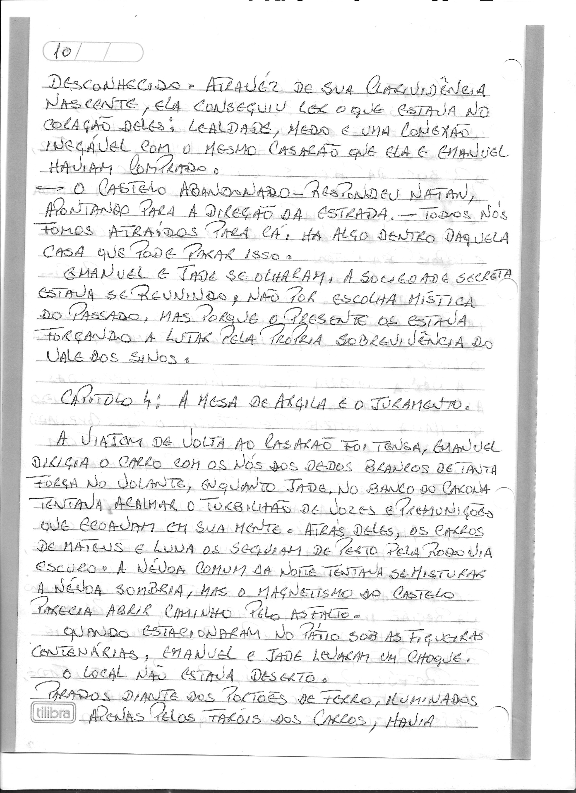
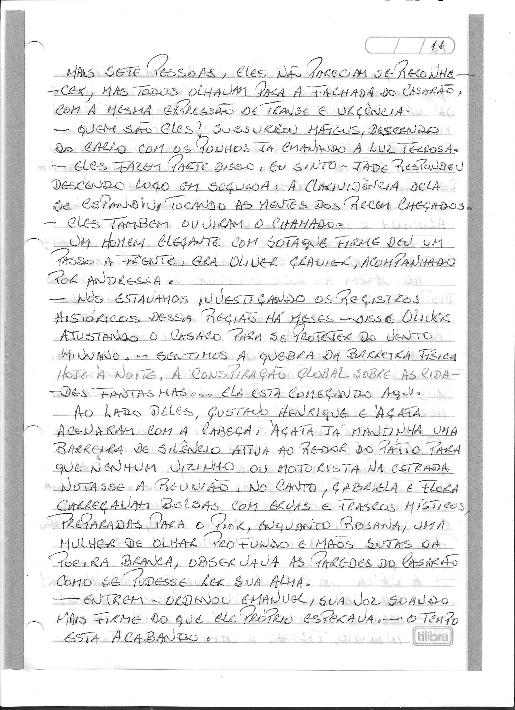
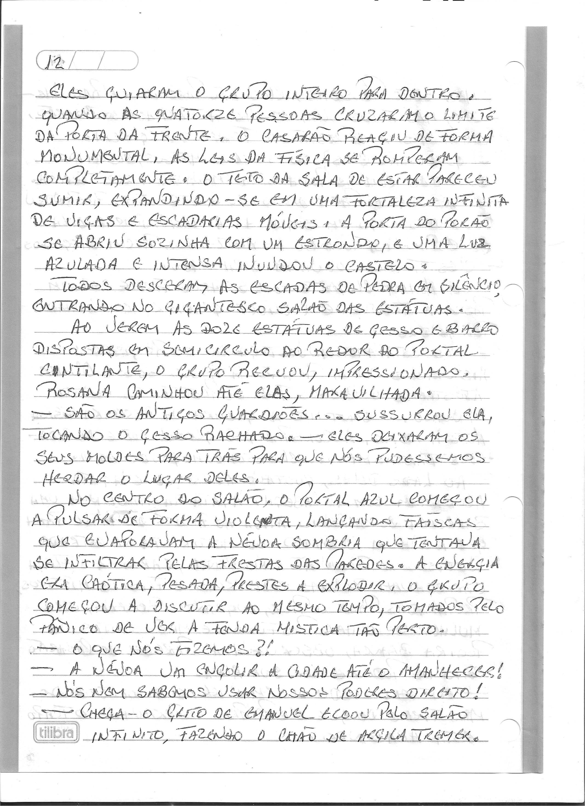
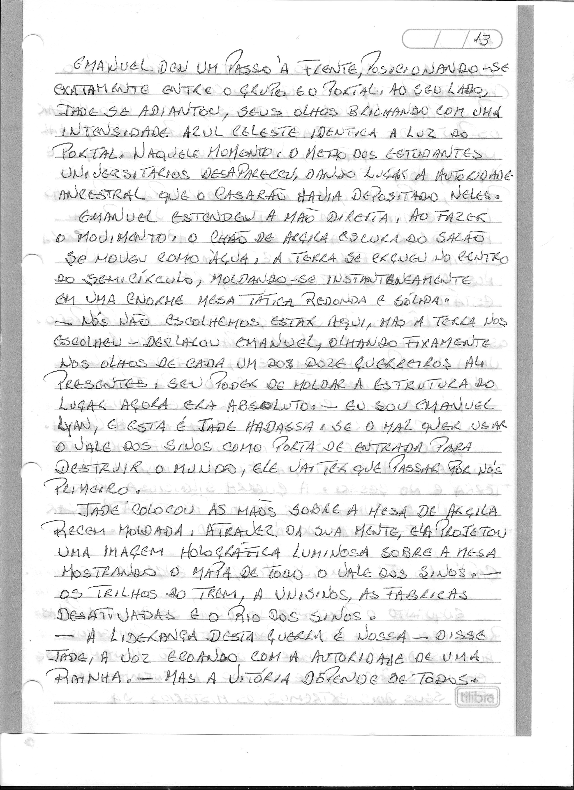

# Capítulo 4: A Mesa de Argila e o Juramento

> Dossiê fac-similar. Uma folha pode conter o final do capítulo anterior ou o início do seguinte. No livro consolidado, cada folha aparece uma vez.

Fonte: `Escrito à mão_2026-09-27_080918.pdf`.

Fonte: `Escrito à mão_2026-09-27_080959.pdf`.

Fonte: `Escrito à mão_2026-09-27_081035.pdf`.

Fonte: `Escrito à mão_2026-09-27_081115.pdf`.

Fonte: `Escrito à mão_2026-09-27_081151.pdf`.
