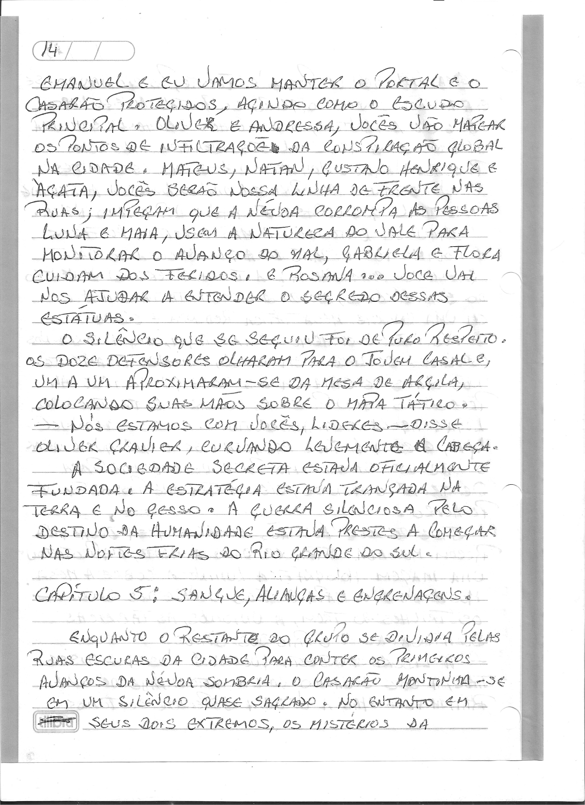
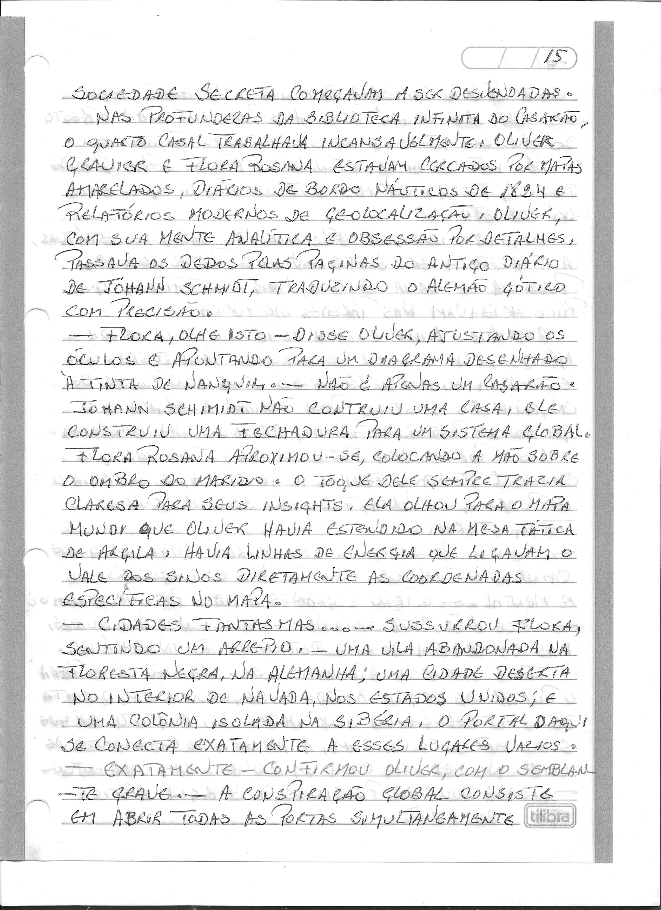
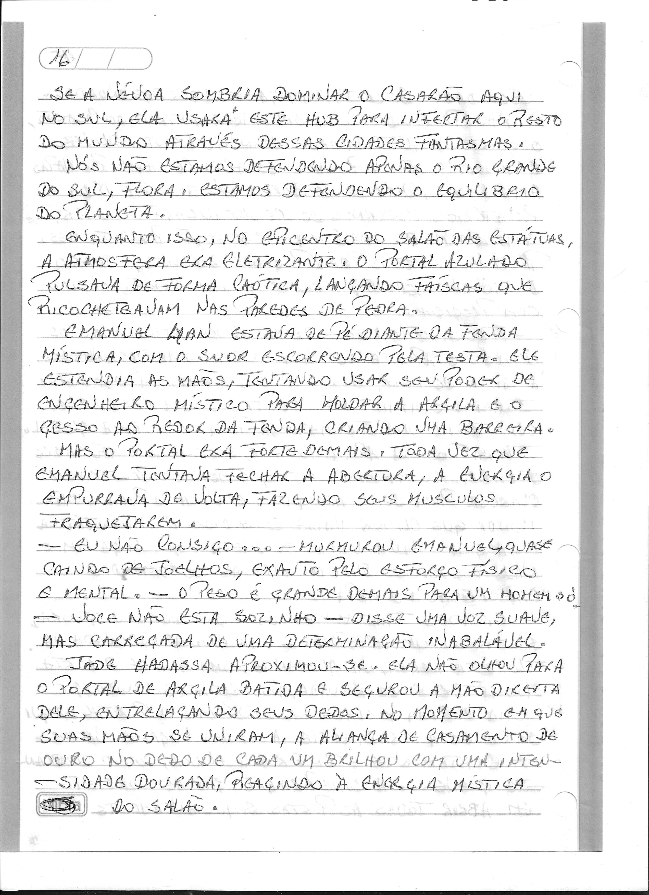
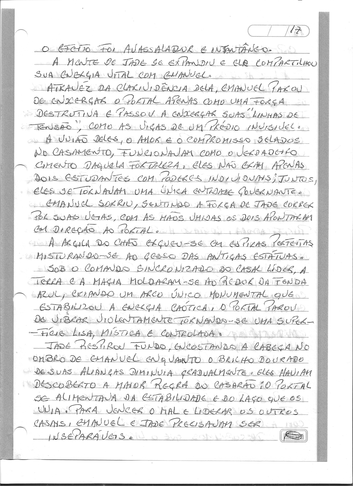

# Capítulo 5: Sangue, Alianças e Engrenagens

> Dossiê fac-similar. Uma folha pode conter o final do capítulo anterior ou o início do seguinte. No livro consolidado, cada folha aparece uma vez.

Fonte: `Escrito à mão_2026-09-27_081151.pdf`.

Fonte: `Escrito à mão_2026-09-27_081234.pdf`.

Fonte: `Escrito à mão_2026-09-27_081311.pdf`.

Fonte: `Escrito à mão_2026-09-27_081352.pdf`.

Fonte: `Escrito à mão_2026-09-27_081429.pdf`.
