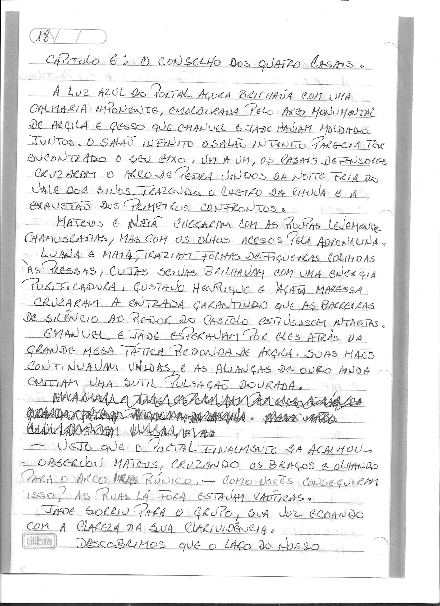
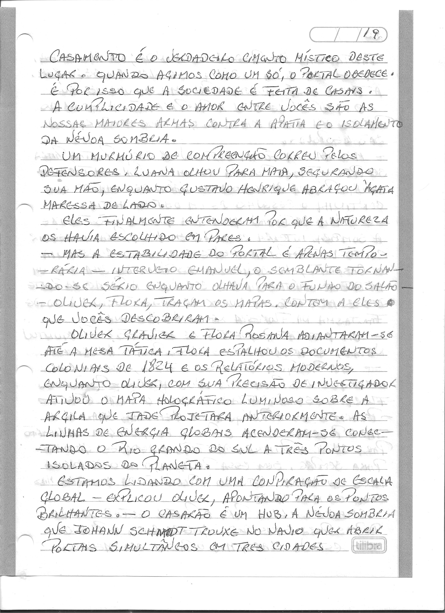
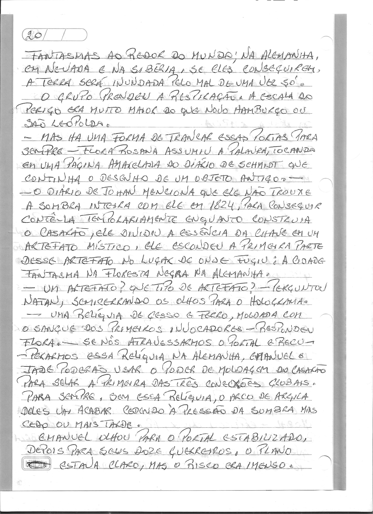

# Capítulo 6: O Conselho das Quatro Chamas

> Dossiê fac-similar. Uma folha pode conter o final do capítulo anterior ou o início do seguinte. No livro consolidado, cada folha aparece uma vez.

Fonte: `Escrito à mão_2026-09-27_081429.pdf`.

Fonte: `Escrito à mão_2026-09-27_081515.pdf`.

Fonte: `Escrito à mão_2026-09-27_081550.pdf`.

Fonte: `Escrito à mão_2026-09-27_081628.pdf`.
