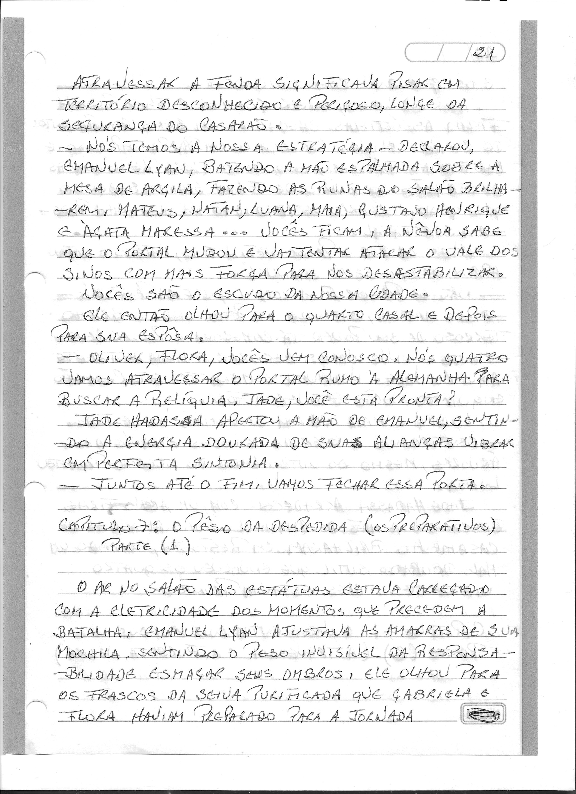
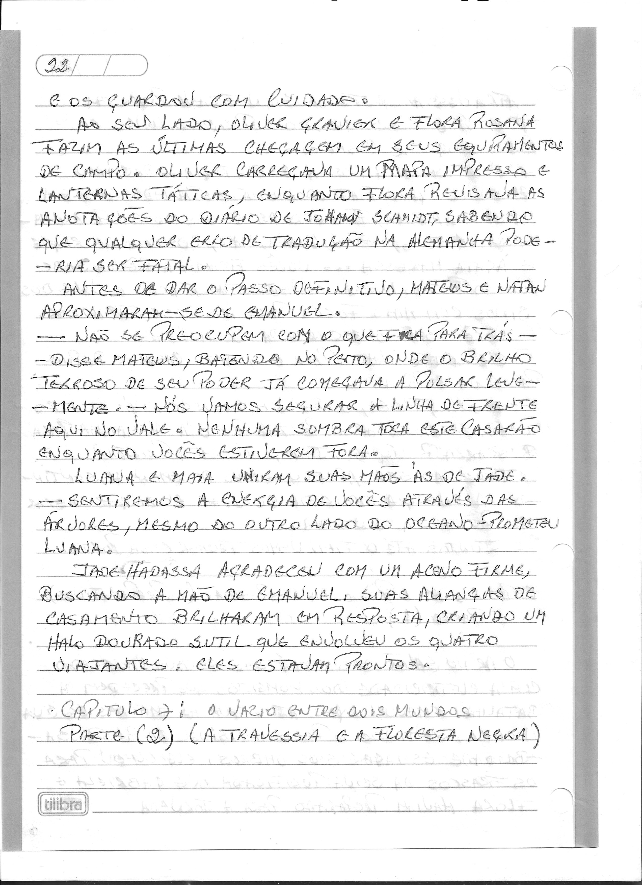
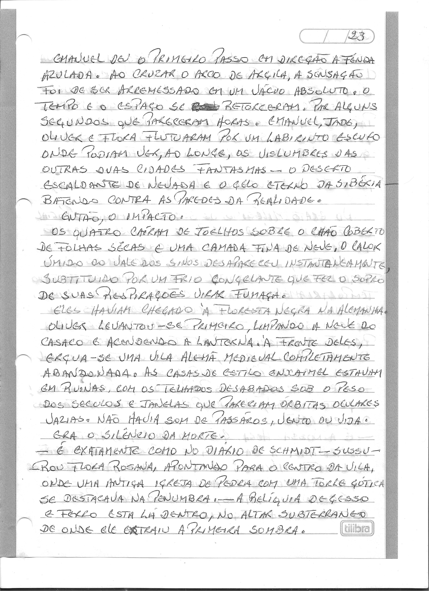
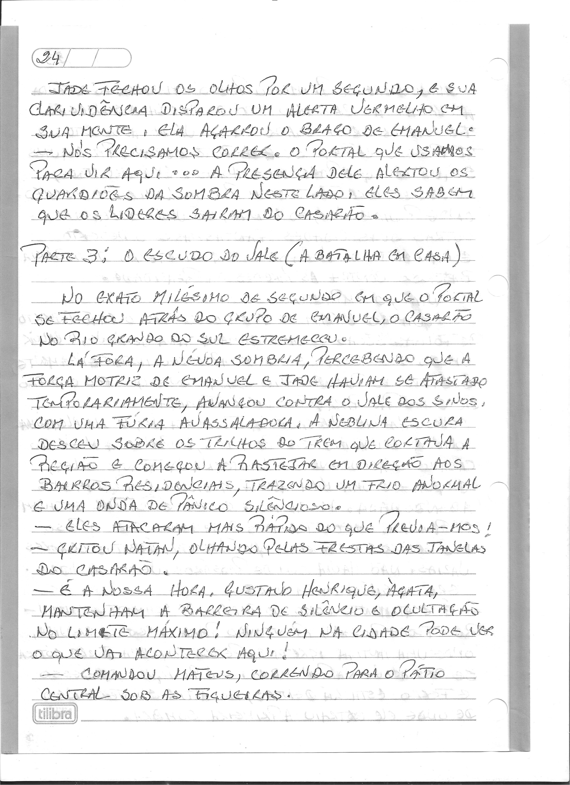
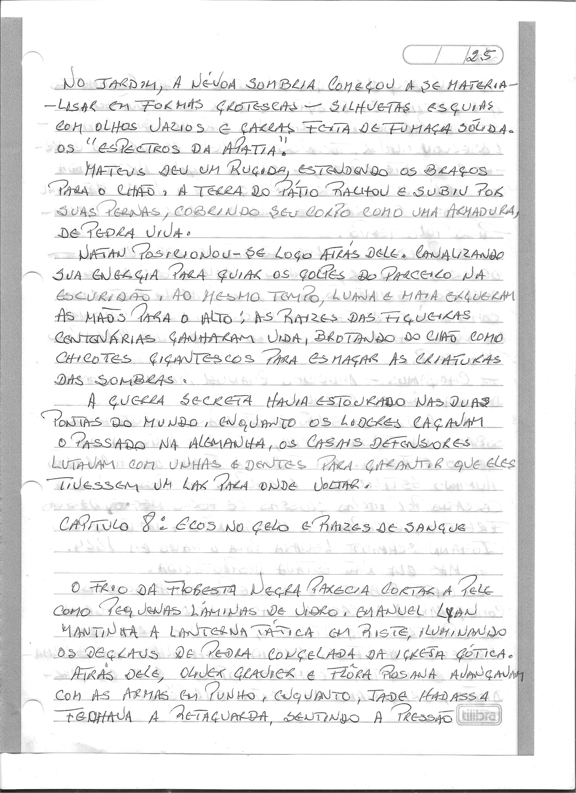

# Capítulo 7: Frentes Partidas

> Dossiê fac-similar. Uma folha pode conter o final do capítulo anterior ou o início do seguinte. No livro consolidado, cada folha aparece uma vez.

Fonte: `Escrito à mão_2026-09-27_081628.pdf`.

Fonte: `Escrito à mão_2026-09-27_081701.pdf`.

Fonte: `Escrito à mão_2026-09-27_081739.pdf`.

Fonte: `Escrito à mão_2026-09-27_081824.pdf`.

Fonte: `Escrito à mão_2026-09-27_082024.pdf`.
