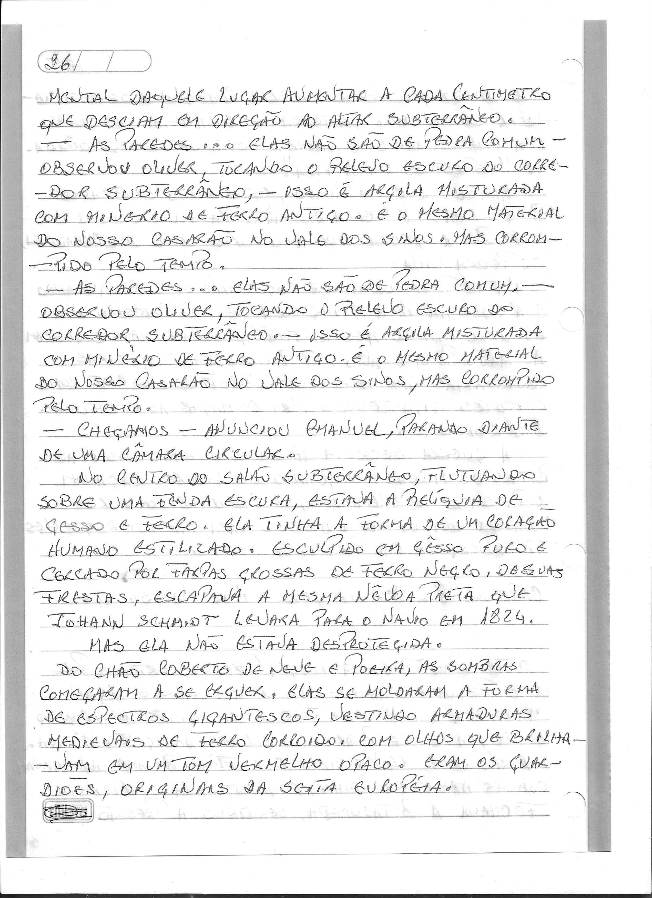
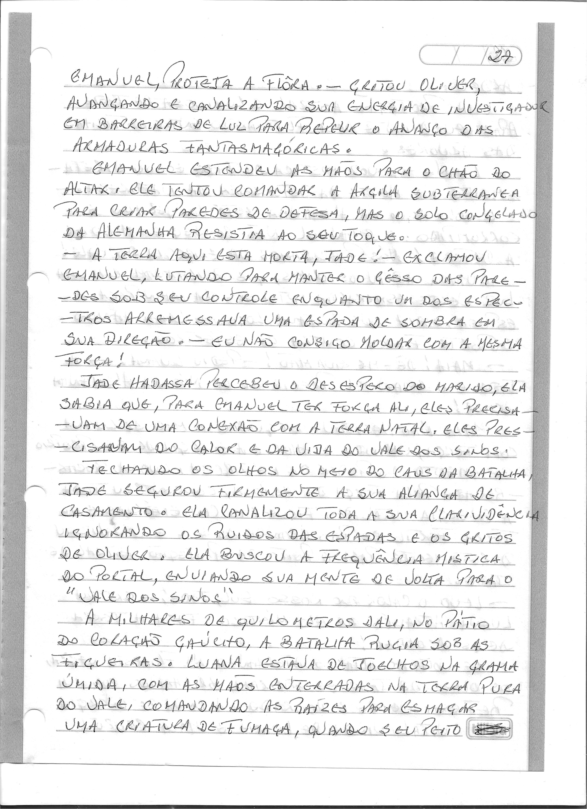
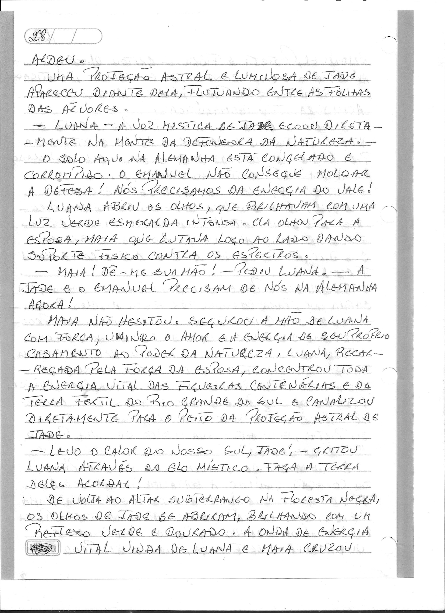
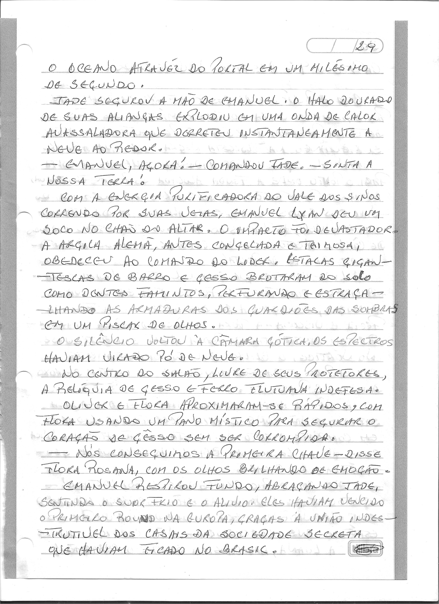

# Capítulo 8: Ecos no Gelo e Raízes de Sangue

> Dossiê fac-similar. Uma folha pode conter o final do capítulo anterior ou o início do seguinte. No livro consolidado, cada folha aparece uma vez.

Fonte: `Escrito à mão_2026-09-27_082024.pdf`.

Fonte: `Escrito à mão_2026-09-27_082102.pdf`.

Fonte: `Escrito à mão_2026-09-27_082143.pdf`.

Fonte: `Escrito à mão_2026-09-27_082219.pdf`.

Fonte: `Escrito à mão_2026-09-27_082301.pdf`.

Fonte: `Escrito à mão_2026-09-27_082340.pdf`.
