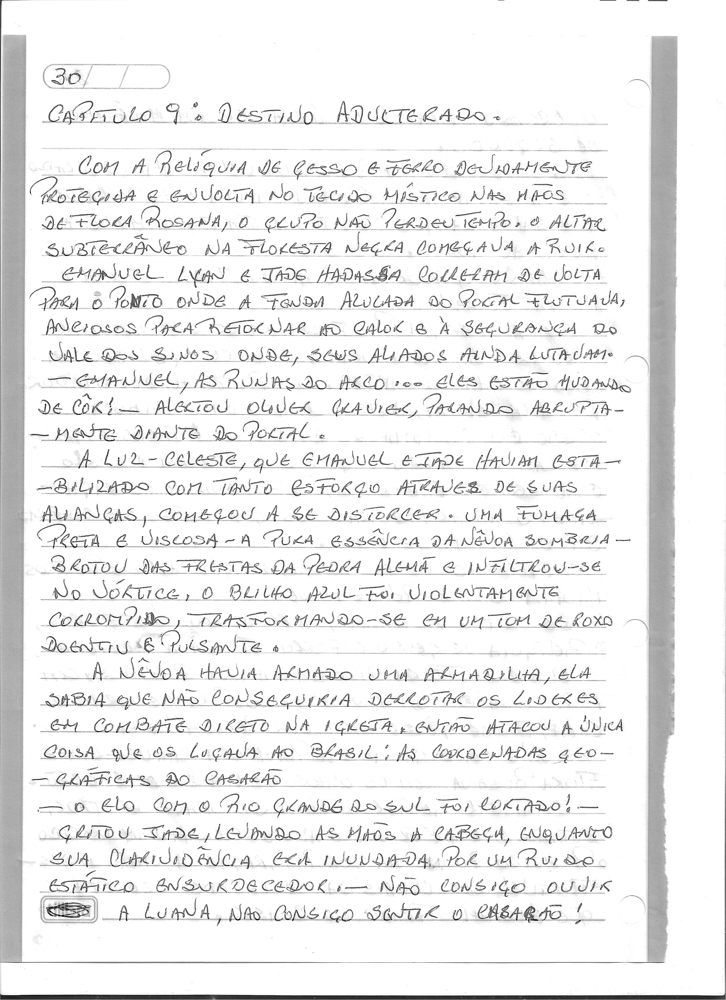
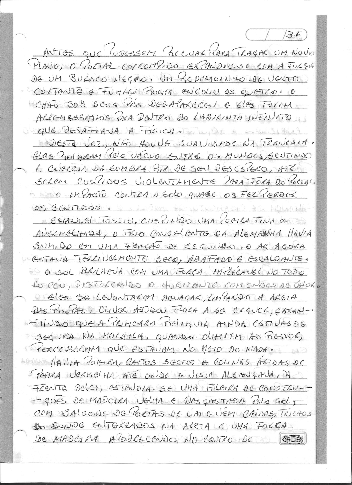
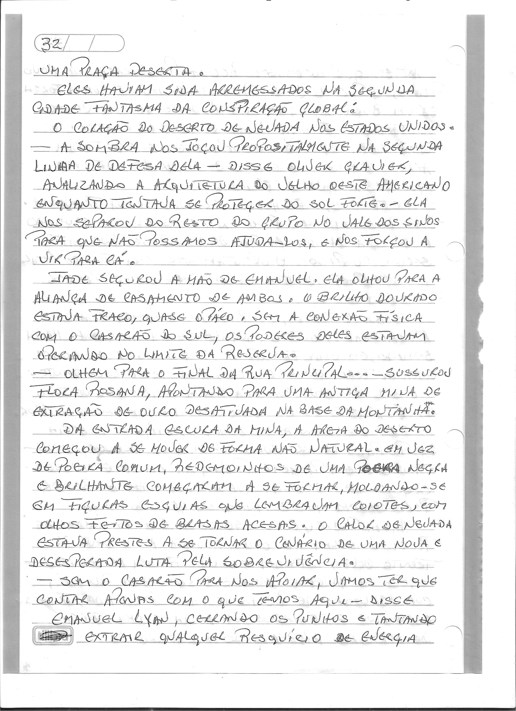
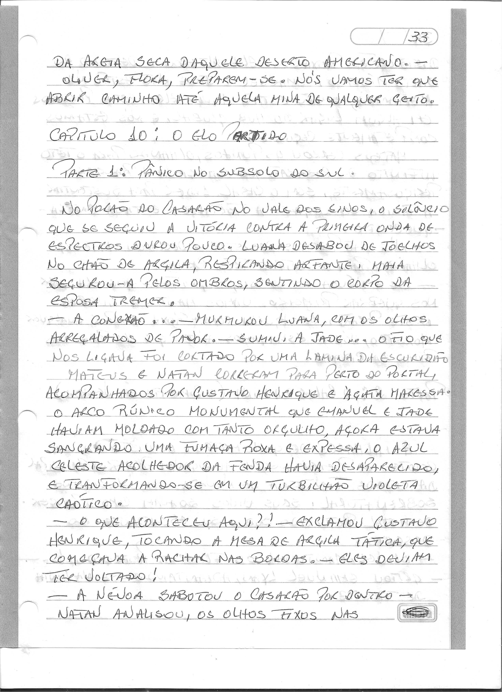

# Capítulo 9: Destino Adulterado

> Dossiê fac-similar. Uma folha pode conter o final do capítulo anterior ou o início do seguinte. No livro consolidado, cada folha aparece uma vez.

Fonte: `Escrito à mão_2026-09-27_082340.pdf`.

Fonte: `Escrito à mão_2026-09-27_082419.pdf`.

Fonte: `Escrito à mão_2026-09-27_082458.pdf`.

Fonte: `Escrito à mão_2026-09-27_082535.pdf`.
