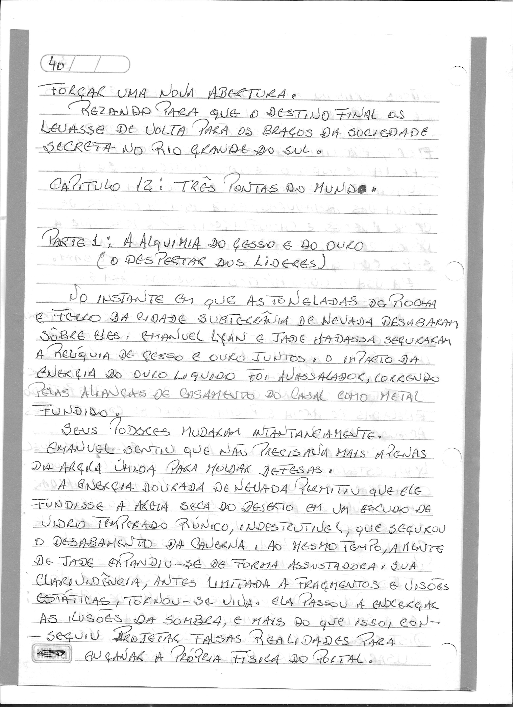
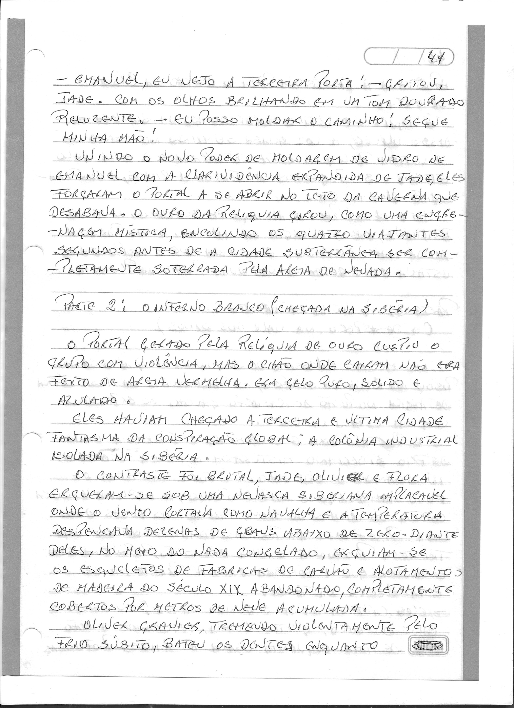
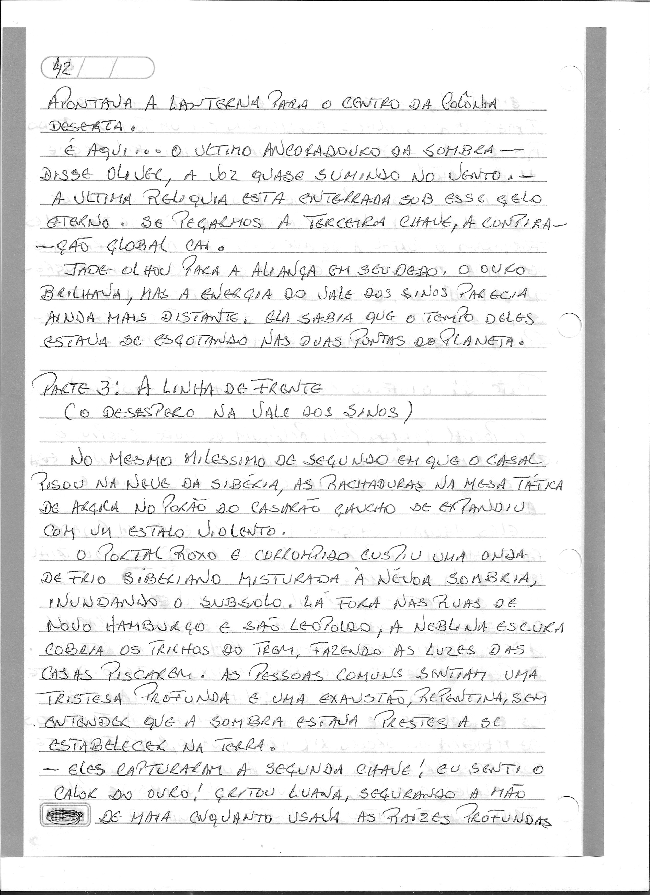

# Capítulo 12: Três Pontos do Mundo

> Dossiê fac-similar. Uma folha pode conter o final do capítulo anterior ou o início do seguinte. No livro consolidado, cada folha aparece uma vez.

Fonte: `Escrito à mão_2026-09-27_083005.pdf`.

Fonte: `Escrito à mão_2026-09-27_083043.pdf`.

Fonte: `Escrito à mão_2026-09-27_083126.pdf`.

Fonte: `Escrito à mão_2026-09-27_083206.pdf`.
