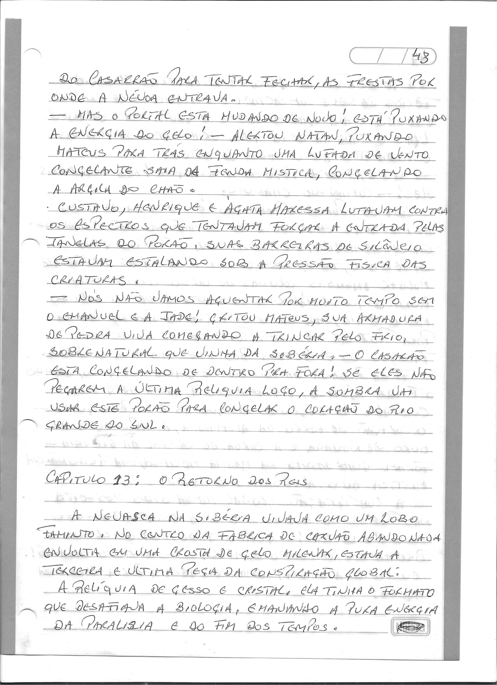
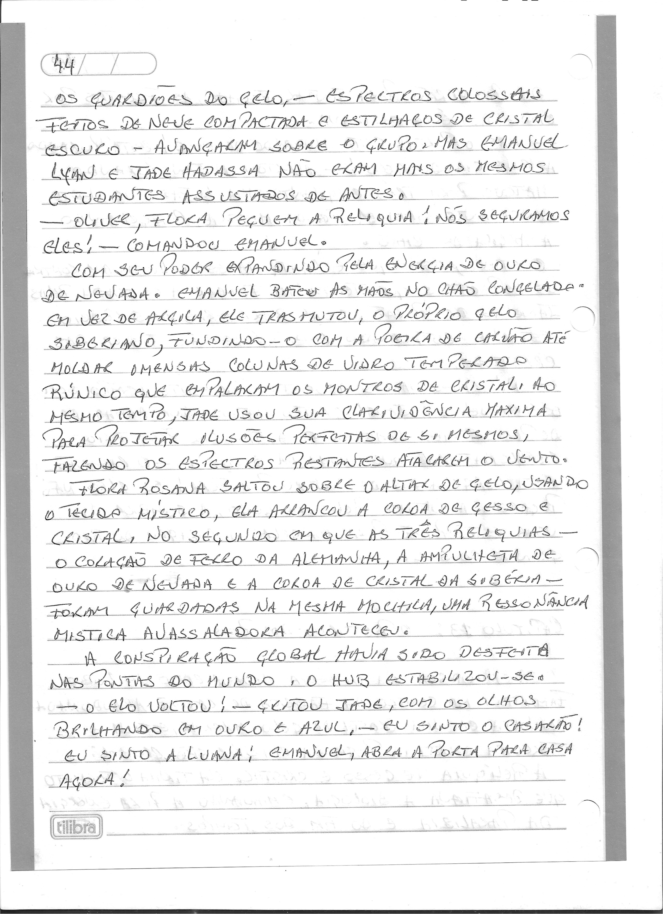
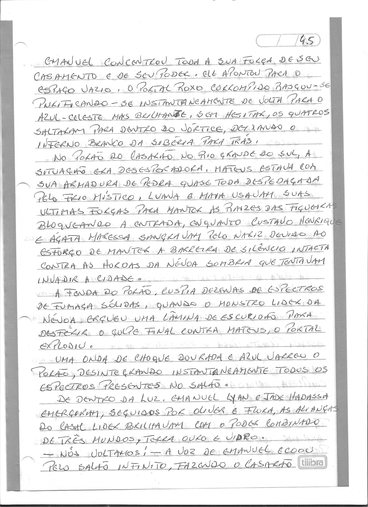
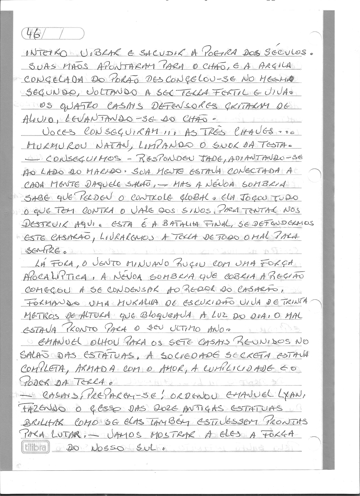
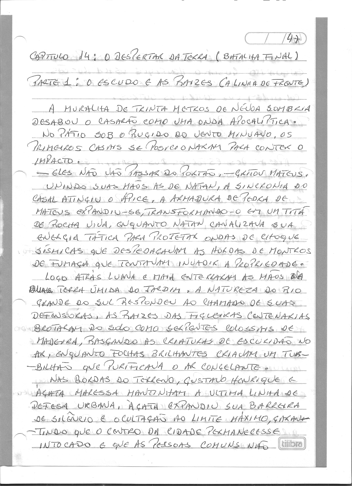

# Capítulo 13: O Retorno dos Reis

> Dossiê fac-similar. Uma folha pode conter o final do capítulo anterior ou o início do seguinte. No livro consolidado, cada folha aparece uma vez.

Fonte: `Escrito à mão_2026-09-27_083206.pdf`.

Fonte: `Escrito à mão_2026-09-27_083243.pdf`.

Fonte: `Escrito à mão_2026-09-27_083328.pdf`.

Fonte: `Escrito à mão_2026-09-27_083402.pdf`.

Fonte: `Escrito à mão_2026-09-27_083442.pdf`.
