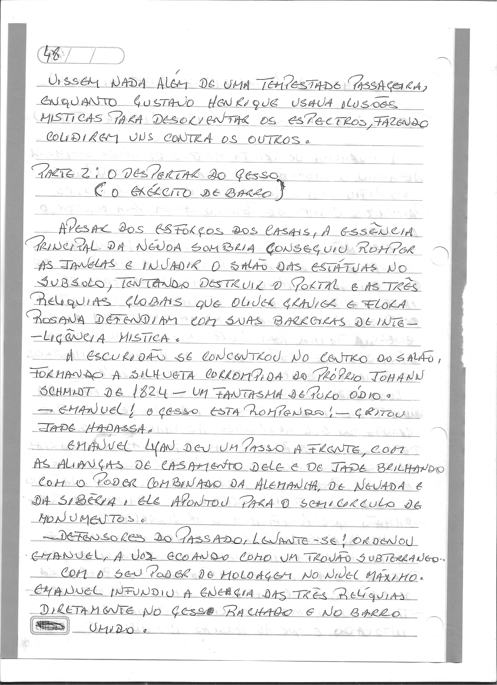
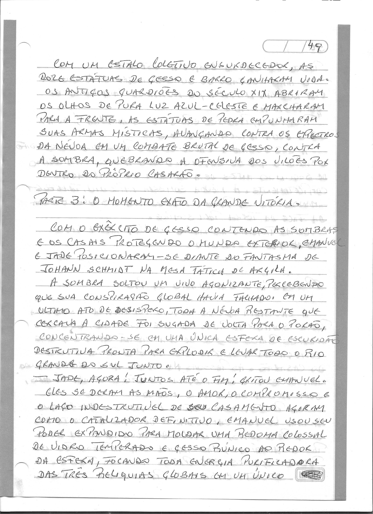

# Capítulo 14: O Despertar da Terra (A Batalha Final)

> Dossiê fac-similar. Uma folha pode conter o final do capítulo anterior ou o início do seguinte. No livro consolidado, cada folha aparece uma vez.

Fonte: `Escrito à mão_2026-09-27_083442.pdf`.

Fonte: `Escrito à mão_2026-09-27_083517.pdf`.

Fonte: `Escrito à mão_2026-09-27_083555.pdf`.

Fonte: `Escrito à mão_2026-09-27_083632.pdf`.
