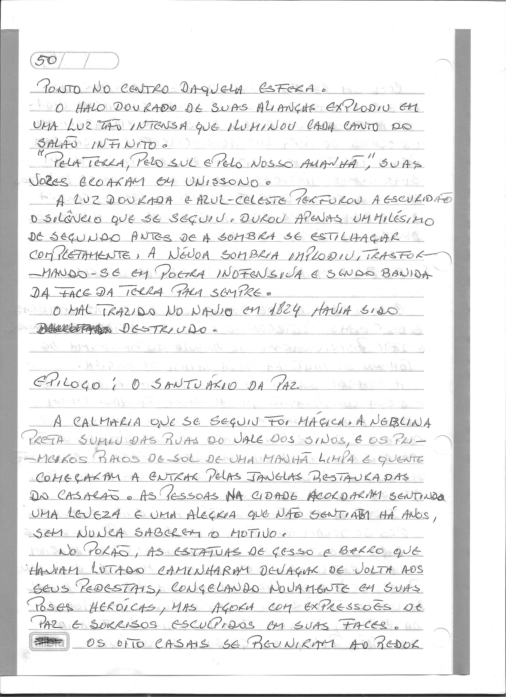
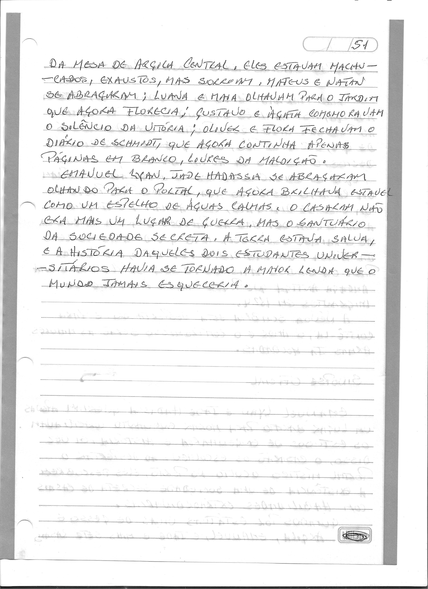

# Epílogo: O Santuário da Paz

> Dossiê fac-similar. Uma folha pode conter o final do capítulo anterior ou o início do seguinte. No livro consolidado, cada folha aparece uma vez.

Fonte: `Escrito à mão_2026-09-27_083632.pdf`.

Fonte: `Escrito à mão_2026-09-27_083716.pdf`.
