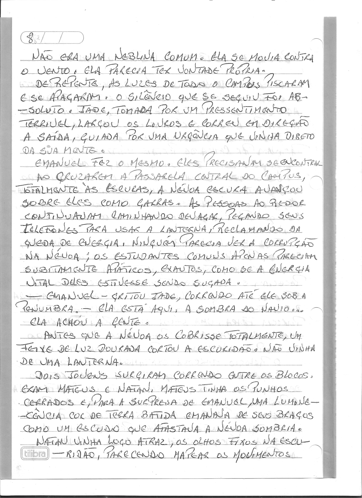
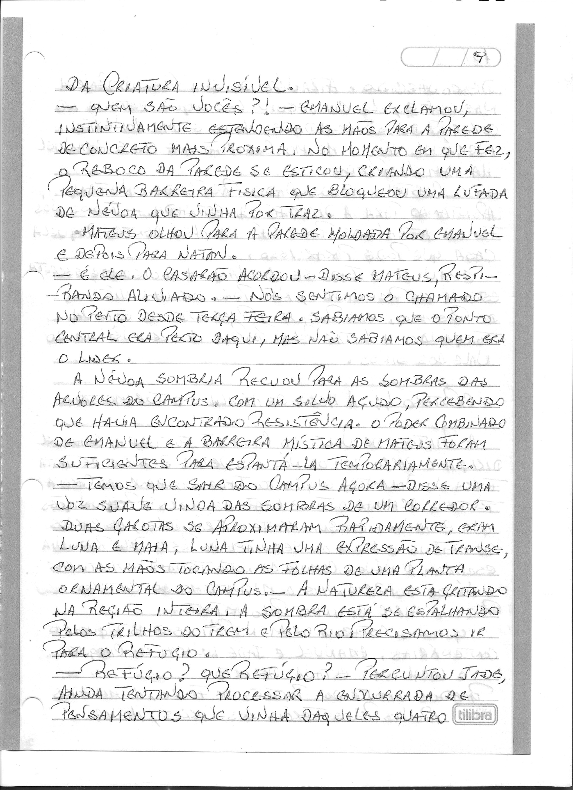
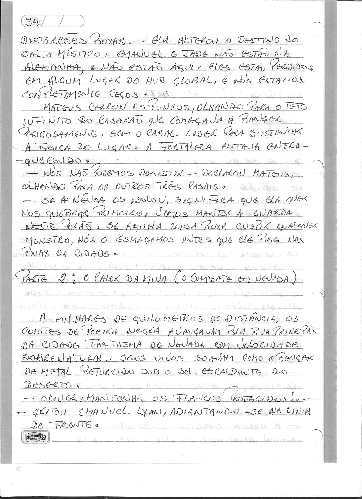
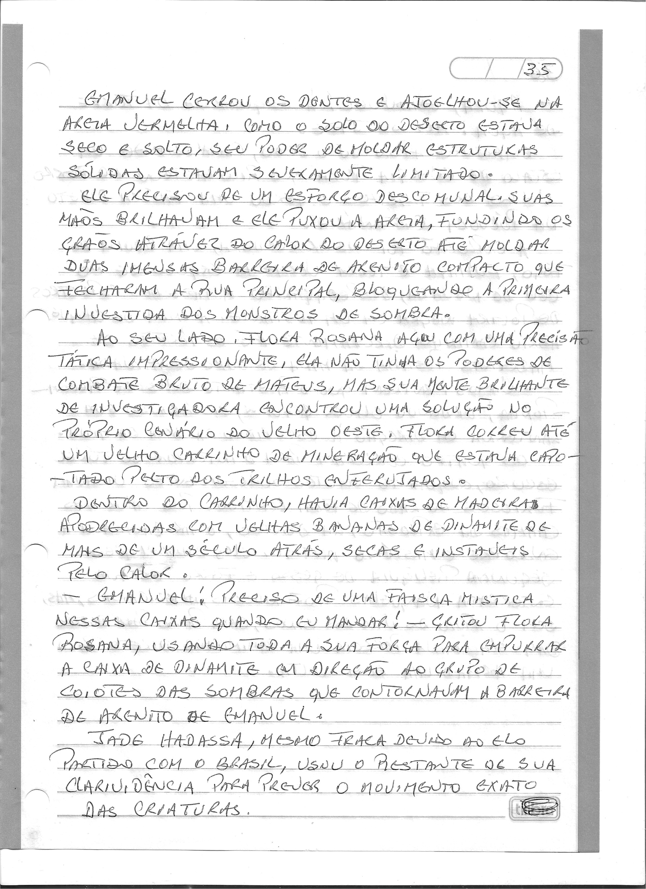
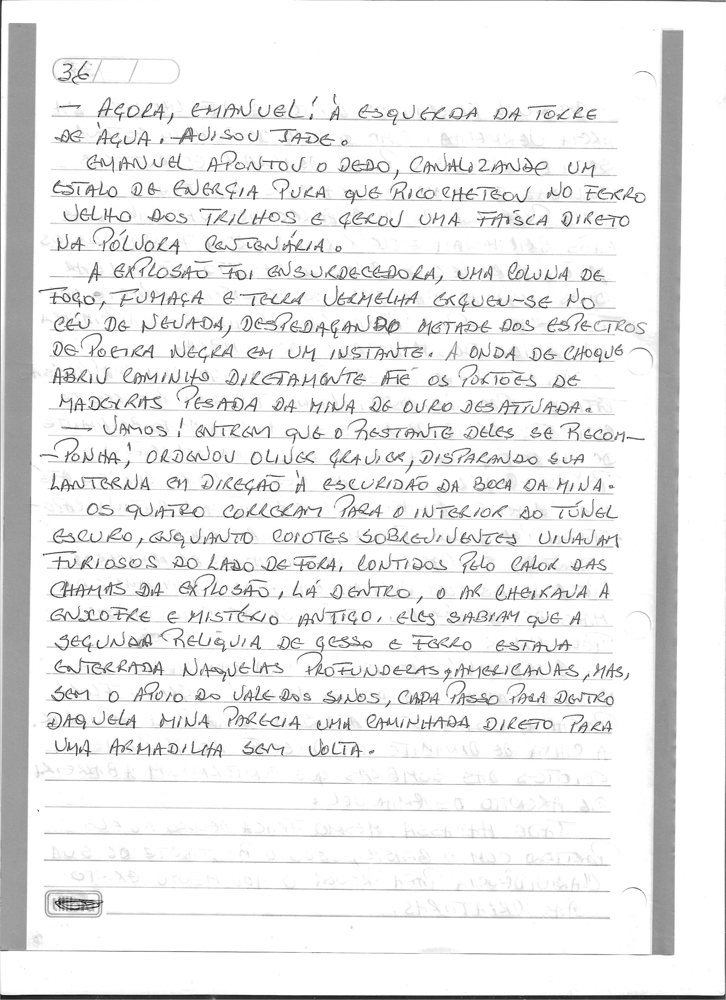
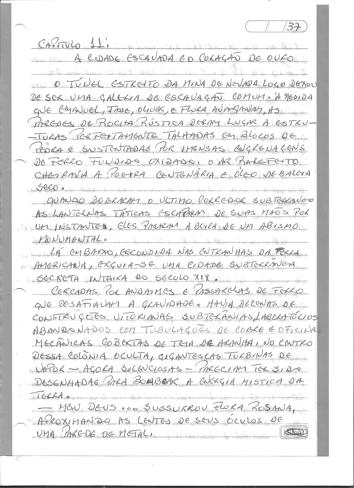
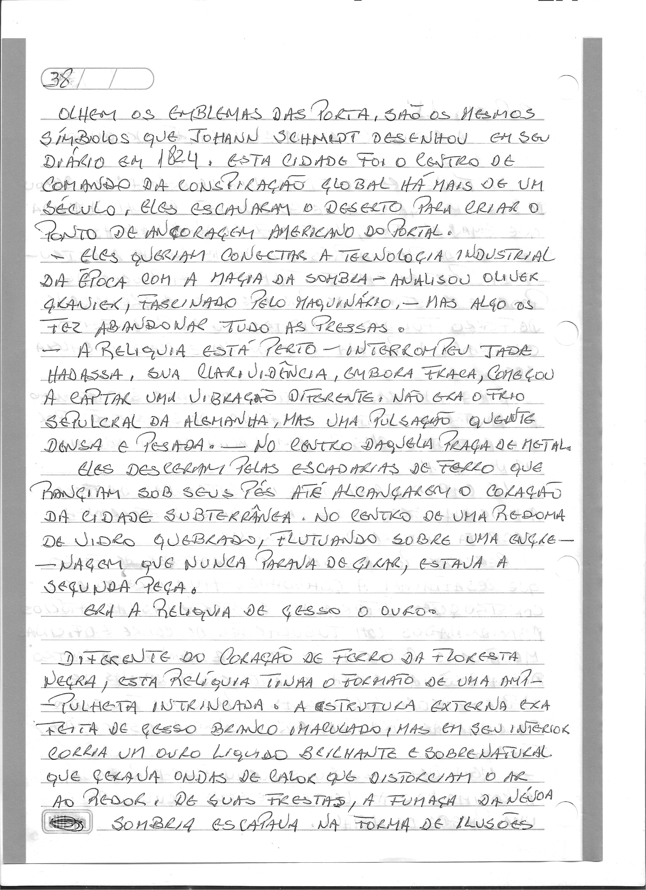
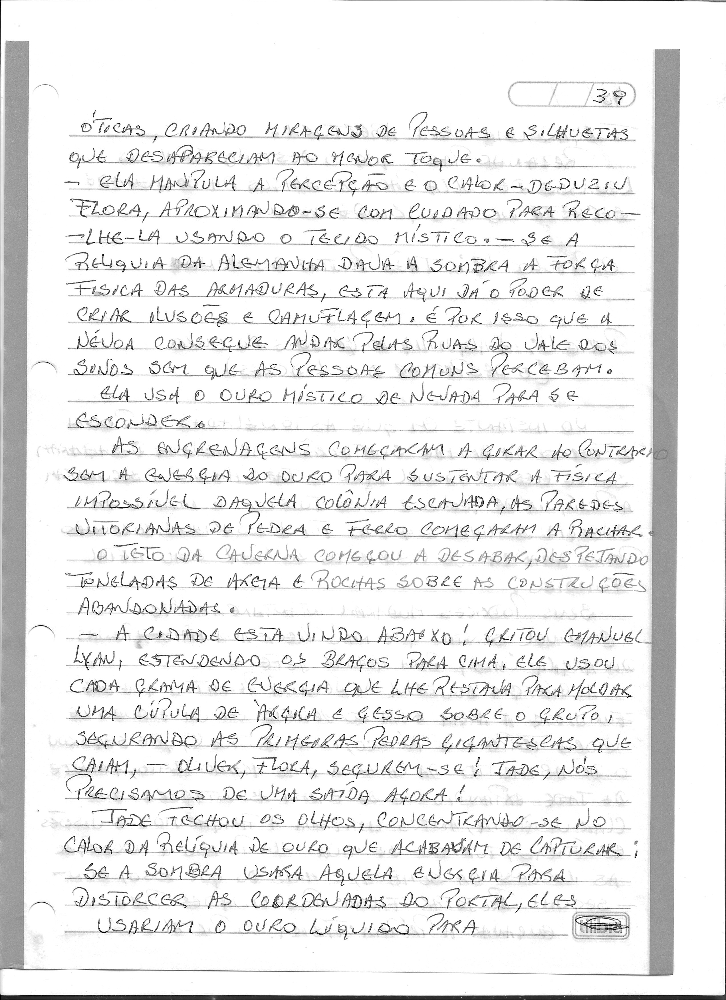

# Ecos da Névoa — O Segredo de 1824

> Edição fac-similar de trabalho: páginas manuscritas, sem transcrição ou revisão literária integral.

## Navegação

- [Prólogo: O Passageiro de 1824](capitulos/00.md)
- [Capítulo 1: O Chamado da Terra](capitulos/01.md)
- [Capítulo 2: O Silêncio da Argila](capitulos/02.md)
- [Capítulo 3: Sombras no Campus](capitulos/03.md)
- [Capítulo 4: A Mesa de Argila e o Juramento](capitulos/04.md)
- [Capítulo 5: Sangue, Alianças e Engrenagens](capitulos/05.md)
- [Capítulo 6: O Conselho das Quatro Chamas](capitulos/06.md)
- [Capítulo 7: Frentes Partidas](capitulos/07.md)
- [Capítulo 8: Ecos no Gelo e Raízes de Sangue](capitulos/08.md)
- [Capítulo 9: Destino Adulterado](capitulos/09.md)
- [Capítulo 10: O Elo Partido](capitulos/10.md)
- [Capítulo 11: A Cidade Escavada e o Coração de Ouro](capitulos/11.md)
- [Capítulo 12: Três Pontos do Mundo](capitulos/12.md)
- [Capítulo 13: O Retorno dos Reis](capitulos/13.md)
- [Capítulo 14: O Despertar da Terra (A Batalha Final)](capitulos/14.md)
- [Epílogo: O Santuário da Paz](capitulos/15.md)

## Páginas do manuscrito

### Prólogo: O Passageiro de 1824

Fonte: `Escrito à mão_2026-09-27_084010.pdf`.

Fonte: `Escrito à mão_2026-09-27_084046.pdf`.

### Capítulo 1: O Chamado da Terra

Fonte: `Escrito à mão_2026-09-27_075923.pdf`.

Fonte: `Escrito à mão_2026-09-27_080008.pdf`.

### Capítulo 2: O Silêncio da Argila

Fonte: `Escrito à mão_2026-09-27_080119.pdf`.

Fonte: `Escrito à mão_2026-09-27_080201.pdf`.

Fonte: `Escrito à mão_2026-09-27_080301.pdf`.

Fonte: `Escrito à mão_2026-09-27_080352.pdf`.

### Capítulo 3: Sombras no Campus

Fonte: `Escrito à mão_2026-09-27_080625.pdf`.

Fonte: `Escrito à mão_2026-09-27_080742.pdf`.

Fonte: `Escrito à mão_2026-09-27_080834.pdf`.

### Capítulo 4: A Mesa de Argila e o Juramento

Fonte: `Escrito à mão_2026-09-27_080918.pdf`.

Fonte: `Escrito à mão_2026-09-27_080959.pdf`.

Fonte: `Escrito à mão_2026-09-27_081035.pdf`.

Fonte: `Escrito à mão_2026-09-27_081115.pdf`.

### Capítulo 5: Sangue, Alianças e Engrenagens

Fonte: `Escrito à mão_2026-09-27_081151.pdf`.

Fonte: `Escrito à mão_2026-09-27_081234.pdf`.

Fonte: `Escrito à mão_2026-09-27_081311.pdf`.

Fonte: `Escrito à mão_2026-09-27_081352.pdf`.

### Capítulo 6: O Conselho das Quatro Chamas

Fonte: `Escrito à mão_2026-09-27_081429.pdf`.

Fonte: `Escrito à mão_2026-09-27_081515.pdf`.

Fonte: `Escrito à mão_2026-09-27_081550.pdf`.

### Capítulo 7: Frentes Partidas

Fonte: `Escrito à mão_2026-09-27_081628.pdf`.

Fonte: `Escrito à mão_2026-09-27_081701.pdf`.

Fonte: `Escrito à mão_2026-09-27_081739.pdf`.

Fonte: `Escrito à mão_2026-09-27_081824.pdf`.

### Capítulo 8: Ecos no Gelo e Raízes de Sangue

Fonte: `Escrito à mão_2026-09-27_082024.pdf`.

Fonte: `Escrito à mão_2026-09-27_082102.pdf`.

Fonte: `Escrito à mão_2026-09-27_082143.pdf`.

Fonte: `Escrito à mão_2026-09-27_082219.pdf`.

Fonte: `Escrito à mão_2026-09-27_082301.pdf`.

### Capítulo 9: Destino Adulterado

Fonte: `Escrito à mão_2026-09-27_082340.pdf`.

Fonte: `Escrito à mão_2026-09-27_082419.pdf`.

Fonte: `Escrito à mão_2026-09-27_082458.pdf`.

### Capítulo 10: O Elo Partido

Fonte: `Escrito à mão_2026-09-27_082535.pdf`.

Fonte: `Escrito à mão_2026-09-27_082611.pdf`.

Fonte: `Escrito à mão_2026-09-27_082657.pdf`.

Fonte: `Escrito à mão_2026-09-27_082734.pdf`.

### Capítulo 11: A Cidade Escavada e o Coração de Ouro

Fonte: `Escrito à mão_2026-09-27_082812.pdf`.

Fonte: `Escrito à mão_2026-09-27_082849.pdf`.

Fonte: `Escrito à mão_2026-09-27_082927.pdf`.

### Capítulo 12: Três Pontos do Mundo

Fonte: `Escrito à mão_2026-09-27_083005.pdf`.

Fonte: `Escrito à mão_2026-09-27_083043.pdf`.

Fonte: `Escrito à mão_2026-09-27_083126.pdf`.

### Capítulo 13: O Retorno dos Reis

Fonte: `Escrito à mão_2026-09-27_083206.pdf`.

Fonte: `Escrito à mão_2026-09-27_083243.pdf`.

Fonte: `Escrito à mão_2026-09-27_083328.pdf`.

Fonte: `Escrito à mão_2026-09-27_083402.pdf`.

### Capítulo 14: O Despertar da Terra (A Batalha Final)

Fonte: `Escrito à mão_2026-09-27_083442.pdf`.

Fonte: `Escrito à mão_2026-09-27_083517.pdf`.

Fonte: `Escrito à mão_2026-09-27_083555.pdf`.

### Epílogo: O Santuário da Paz

Fonte: `Escrito à mão_2026-09-27_083632.pdf`.

Fonte: `Escrito à mão_2026-09-27_083716.pdf`.
